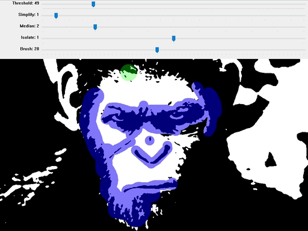

## 🎨 PochoirMaker

PochoirMaker is a peculiar tool that helps you selectively transform any picture into a pure black & white cutout, stencil-style, better than any automated filter.

Most photographs don't make good stencils right away because of their uneven levels. For instance, one half of a face will be shadowed while the other half will be bright, hence **a threshold filter applied uniformly will always burn some parts** into pure black or pure white, making it a real pain to get a useable result.

PochoirMaker aims to let you guide the filtering by freezing parts of the image when they look best, then moving on with other parts at a different threshold value. This way you end up with a well-balanced black & white image, ready for a bit of cleaning and/or vectorizing.


#### Features

- Import JPG, PNG, BMP, TIF images of any size (be reasonable though).
- Interactive Threshold filter to pick just the right level from 0 to 255.
- Optional Simplification and Median filters to remove noise and small details.
- Mask painting to freeze specific parts of the image when they look best.
- Awesome Cutout filter to give your image that final stencil touch.
- Optional source image overlay for comparisons purpose.
- Ugly and cumbersome UI that can't be resized.

#### Prerequisites

This tool was originally made as a .py script, thus requiring a working Python environment + a few dependencies:

```
pip install opencv-python pillow numpy
```

But I'm a lazy guy and I hate it when, after a few years, a useful script stops working because some dependency update broke it... So I compiled PochoirMaker into a sexy 59 MB .exe, thanks to PyInstaller. Anyone with a decent Windows PC can use the .exe, you don't need Python, there's nothing to install, it's all self-contained and portable.

### 🛠️ How to use

*Foreword: The source picture you choose matters a lot. Although PochoirMaker helps getting the best contrast and clarity from complicated images, its magic won't always work on a bad source. You may also want to first remove or simplify the background and unimportant parts of the picture, using your favorite image editor. It can save some time and make your work in PochoirMaker easier.*

On opening PochoirMaker you will be prompted to select an input file, then you will see the black & white filtered image (no, you can't zoom in or out – sorry about that). Try different values for **Simplification and Median** to stylize the shapes to your liking.

Use the **right mouse button to pan** the viewport, use the **left mouse button to paint** a green mask that will freeze the covered areas. As soon as you change the Threshold value, your active mask 🟢 will be merged into the final mask 🔵. You can **change the brush size** with the related slider.

Press the [E] key to toggle **Eraser mode** 🔴 and remove parts of the masks – that's as close to an Undo feature as you will get. Press the [S] key at any time to prompt a "Save As..." dialog box. The saved image is a PNG named after the input file + a "_pochoir" suffix and a version number; each time you save your work, the file name will be incremented. You are of course free to name it differently.

*Note: If you plan to use your stencil IRL, keep in mind that every white area should be connected to the main paper sheet ultimately. No floating white shapes! You want everything to be easy to cut out and paint. The example I made is VERY BAD on that matter.*



---

#### Source

You may find the code of PochoirMaker messy and unprofessional: that's totally normal. I'm not a developer and had ChatGPT churn it all out, following my directions (in French 🇫🇷 ). But the tool is fully functional, it doesn't crash and does what it's asked. And I made a cute icon for it!

If you feel like improving this tool, adding features like zoom in/out, undo/redo – please do so! I'm not claiming ownership on any of this and would love to see people use and improve it.

#### Credits

Concept by Pezito  
Code by [ChatGPT](https://chatgpt.com)  
Powered by [Python](https://www.python.org)  
Binary by [PyInstaller](https://pyinstaller.org)
